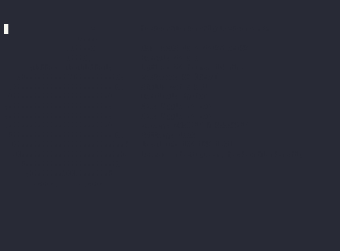

<h1 align="center">
  <br>
  ❯ dotfiles by jax
  <br>
</h1>

<p align="center">
  <a href="https://github.com/jacksonblankenship/dotfiles/actions/workflows/smoke.yml">
    
  </a>
  <a href="https://github.com/jacksonblankenship/dotfiles/actions/workflows/shellcheck.yml">
    
  </a>
  <a href="https://github.com/jacksonblankenship/dotfiles/actions/workflows/fishcheck.yml">
    
  </a>
</p>

<p align="center">My personal and <i>highly opinionated</i> macOS configuration, powered by <a href="https://fishshell.com/" target="_blank">fish</a> and <a href="https://sw.kovidgoyal.net/kitty" target="_blank">kitty</a>. This dotfile management solution was inspired by <a href="https://news.ycombinator.com/item?id=11071754" target="_blank">SneakyCobra's post</a> on HackerNews. If you're looking for a friendlier explanation, Atlassian has a <a href="https://www.atlassian.com/git/tutorials/dotfiles" target="_blank">great post</a> that I'd recommend you check out.</p>

<p align="center">
  <a href="#installation">Installation</a> •
  <a href="#usage">Usage</a>
</p>

<p align="center">
  
</p>


# Installation

Before continuing, be sure you've installed macOS command line tools

```bash
xcode-select --install
```

The following command will execute the bootstrap script, preparing the environment to work correctly with the dotfiles. **Warning:** This will override any conflicting dotfiles with the dotfiles in this repository. I recommend you only run this script if you **know what you're doing**.

```bash
/bin/bash -c "$(curl -s -H 'Cache-Control: no-cache' https://raw.githubusercontent.com/jacksonblankenship/dotfiles/main/.config/dotfiles/bootstrap.sh)" && exit
```

# Usage

After bootstrap, you'll have a fish function, `dot`, available in your environment. Use this alias as you would typically use Git. Keep in mind that we're working with a bare git repository, so there are a few quirks to keep an eye out for. Pushing and pulling work just fine. I recommend that you be specific about what you're attempting to interface with (i.e. `dot push origin main` or `dot pull origin main`).
